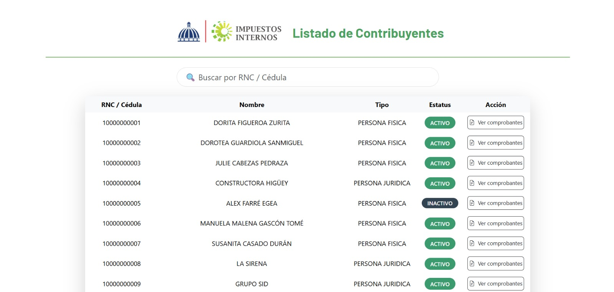
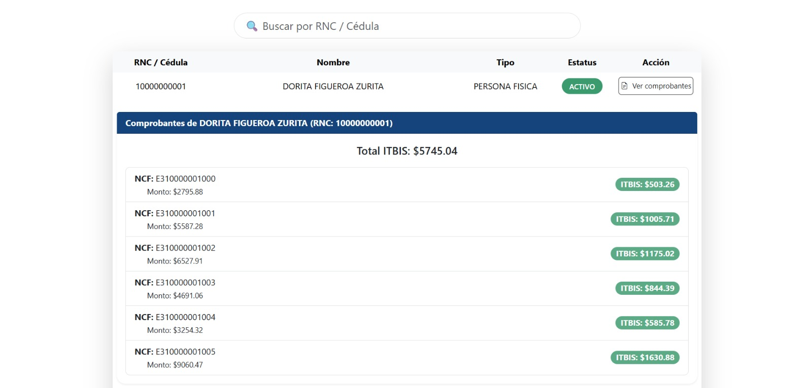

DGIIApp - Prueba Técnica Programador

Descripción General

El sistema permite a los directivos consultar:

- El listado de todos los contribuyentes registrados (personas físicas o jurídicas).
- Los comprobantes fiscales asociados a cada contribuyente.
- El total del ITBIS acumulado por contribuyente.
- Clasificación automática de contribuyentes como ACTIVO o INACTIVO según si poseen comprobantes.

Vista previa de la aplicación

Listado de contribuyentes



Comprobantes por contribuyente



# Tecnologías utilizadas

# Backend (.NET Core)
- ASP.NET Core 7
- Entity Framework Core con SQLite (persistencia real)
- Arquitectura por capas (Controllers, Services, Data, Models)
- Middleware para manejo global de excepciones
- Logging estructurado
- Inyección de dependencias
- Tests unitarios con xUnit + EF InMemory

# Frontend (Angular)
- Angular CLI 16+
- Bootstrap 5
- Componentes organizados por módulo
- Filtro de búsqueda y botones con estilo profesional

---

# Requisitos cumplidos

- ✔ Utiliza .NET Core y Angular
- ✔ Separación de responsabilidades en distintas capas
- ✔ Middleware global de manejo de errores y logging
- ✔ Principios SOLID aplicados
- ✔ Inyección de dependencias
- ✔ Tests unitarios funcionales
- ✔ Base de datos `dgii.db` incluida (sin necesidad de crearla manualmente)


# Tests Unitarios (xUnit)

Se implementaron pruebas para:

**ContribuyenteService**
- `GetAllAsync()`

**ComprobanteService**
- `GetAllAsync()`
- `GetTotalItbisByRncAsync()`

Todos los tests fueron ejecutados correctamente.

---

Instrucciones para clonar y ejecutar
Clonar el repositorio

```bash
git clone https://github.com/kevinfernandezur/DGIIApp1.git
cd DGIIApp1
```

---

Ejecutar el Backend (.NET Core)
Abre Visual Studio 2022:

1. Abre la carpeta `DGIIApp/`
2. Asegúrate que esté seleccionado el proyecto `DGIIApp.csproj`
3. Presiona `Ctrl + F5` para ejecutar sin depuración
4. Swagger se abrirá en el navegador (`https://localhost:xxxx/swagger`)
5. La base de datos `dgii.db` ya está incluida y lista para usar

Ejecutar el Frontend (Angular)
```bash
cd dgii-app-frontend
npm install
ng serve
```

Abre el navegador en: [http://localhost:4200](http://localhost:4200)

---


